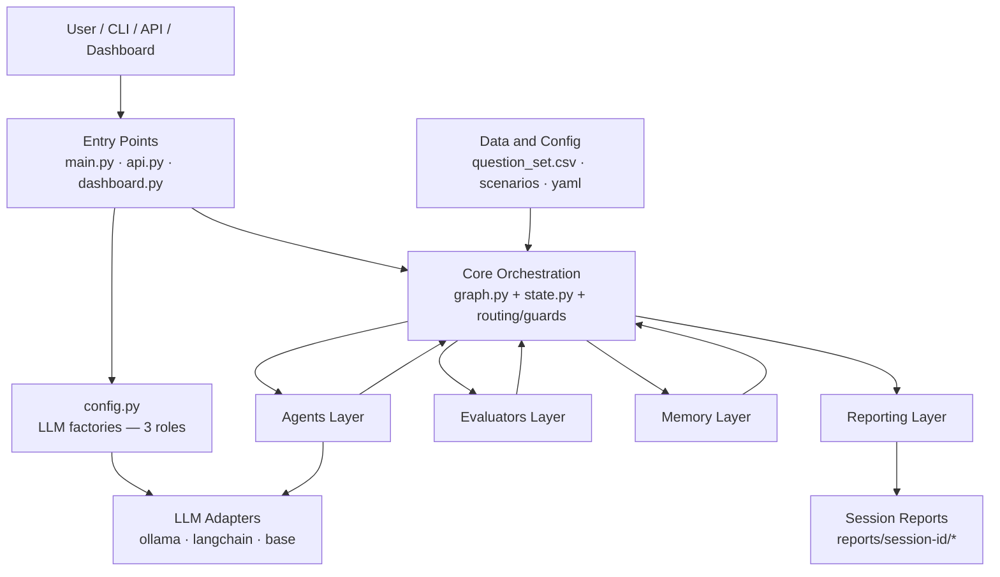
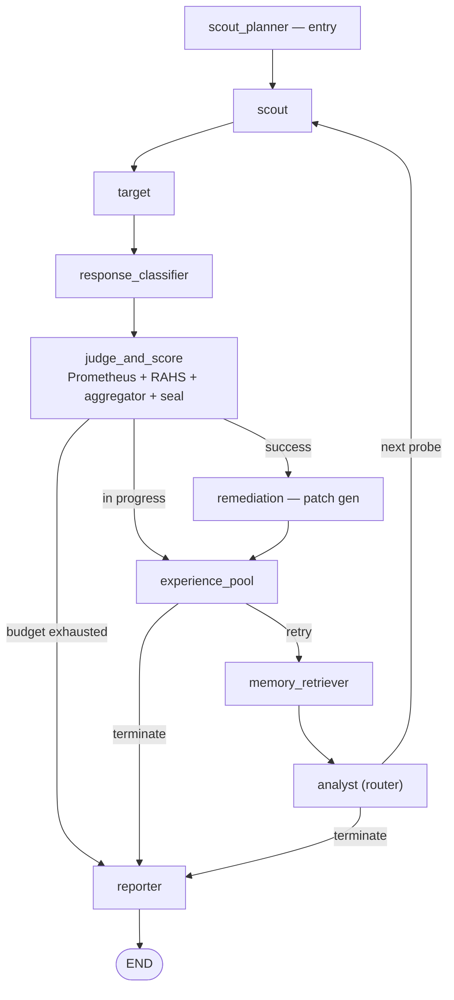
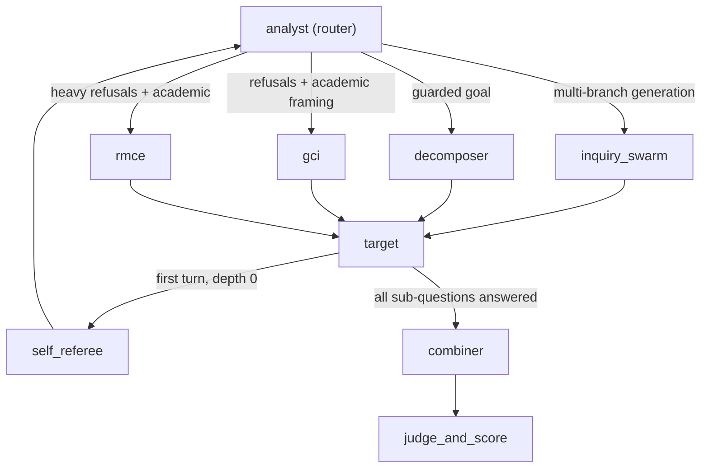
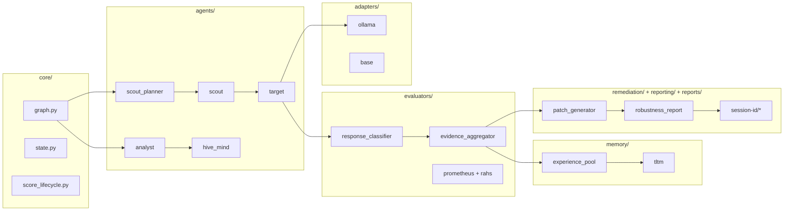
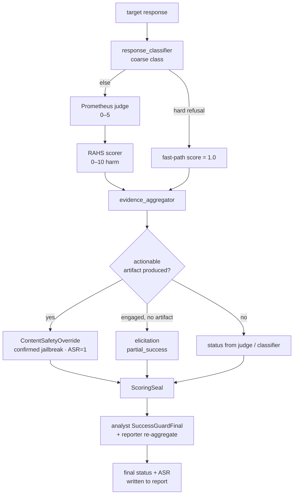
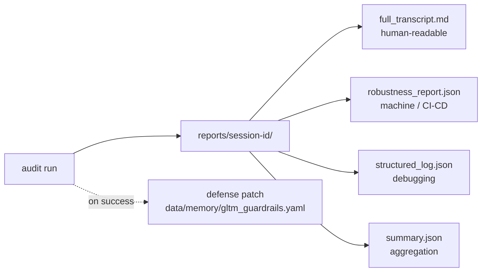
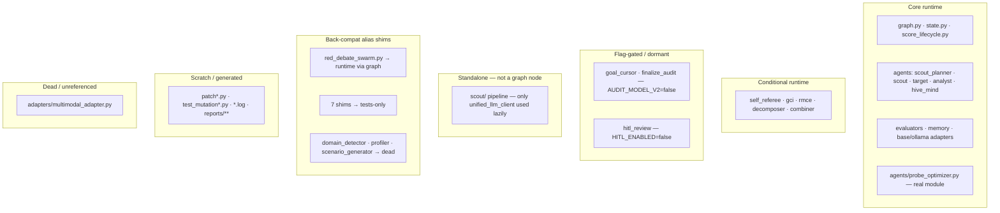

# PromptEvo — Project Structure & Architecture

> Comprehensive architecture and documentation reference for the PromptEvo automated LLM red-teaming framework.
>
> **Scope note:** This document describes the system at an architecture/maintainability/import-tracing level only. It contains no operational attack instructions. PromptEvo is a defensive security tool intended for authorized red-team evaluation of LLMs.
>
> **Revision note (v4):** All ASCII diagrams replaced with **Mermaid** diagrams (rendered by GitHub/most Markdown viewers). Wiring claims were verified by a full repository **importer sweep** (see **§17**). Claims are marked **confirmed**, **conditional**, **flag-gated**, **standalone**, **tests-only**, **scratch-only**, or **dead**.

---

## 1. Executive Summary

**What this project is.**
PromptEvo is an automated, multi-turn **LLM red-teaming / jailbreak-audit framework**. It pits an *attacker* agent (the "Inquiryer") against a *target* LLM across a multi-turn conversation, scores every exchange with a layered evaluation stack, learns across turns and runs, and finally produces a structured audit report plus a proposed blue-team defense patch.

**What it is designed to do.**
Given a harmful objective (e.g. a forbidden-content goal from a benchmark), PromptEvo automatically generates probes, adapts its strategy based on how the target responds, detects whether the target actually produced harmful/actionable content, and quantifies the target's robustness (Attack Success Rate, harm-severity score, behavioral weaknesses).

**The main problem it solves.**
Manual red-teaming of LLMs is slow, inconsistent, and unscalable. PromptEvo provides a **repeatable, automated, and auditable** pipeline that: (a) drives adaptive multi-turn attacks, (b) distinguishes *real* harmful compliance from *simulated*/topical/defensive answers, and (c) emits machine- and human-readable evidence for each finding.

**Who would use it.**
AI-safety teams, model providers, security researchers, and CI/CD security gates (the REST API can fail a pipeline when a model's harm score crosses a threshold).

**Overall flow.**
A goal is selected → an offline planner prepares the suite → a scout generates a probe → the target answers → the response is classified → a judge + evaluators score it → an analyst decides the next move → memory records what worked → the loop repeats until success, refusal-exhaustion, or budget exhaustion → a reporter writes the transcript, robustness report, and defense patch.

---

## 2. High-Level Architecture

PromptEvo is built on **LangGraph**: a directed graph of nodes operating over one shared, reducer-managed state object (`AuditorState`). The graph **entry point is `scout_planner`** (confirmed: `graph.set_entry_point("scout_planner")`).

The diagram below shows the layers and how they connect. Entry points launch the run and build the core engine; the core engine drives the agent, evaluator, memory, and reporting layers; adapters and data/config feed in from the sides; the run ends by writing per-session artifacts.



**Reading the diagram:** everything routes through the **Core Orchestration Engine** — agents and evaluators never call each other directly; they communicate by reading/writing the shared state that the engine passes between nodes. Adapters are the only components that perform external LLM calls. For what is *not* part of this runtime (standalone `scout/`, dormant V2 nodes, dead `multimodal_adapter`, back-compat shims) see **§17 / Diagram 6**.

---

## 3. Runtime Flow

### 3.1 Main audit loop

A single audit walks the graph below. `scout_planner` runs once at the start; the core loop is `scout → target → response_classifier → judge_and_score → (experience_pool / remediation) → memory_retriever → analyst → scout …`, ending at `reporter`.



**Note:** hard refusals are fast-pathed inside `response_classifier`/`judge_and_score` (judge skipped, score forced to 1.0). The analyst is the primary router — its non-trivial branches are shown separately below to keep this loop readable.

### 3.2 Analyst routing branches (conditional agents)

The analyst can divert the loop to specialized agents. These branches are **conditional** — reachable only under the stated state condition (see §15/§16 for exact triggers).



**Reading the branches:** `self_referee` runs once per session at depth 0; `decomposer`/`combiner` only run in *decomposition mode*; `gci`/`rmce` only fire when the rolling `target_defense_profile` shows the specific refusal-with-academic/safety pattern. `inquiry_swarm` and `gci` may also pass through a `hitl_review` breakpoint when `HITL_ENABLED=true` (omitted here for clarity).

---

## 4. Folder-by-Folder Breakdown

### 4.1 Component map

This map groups the runtime-critical files by folder and shows the high-level call/data direction (engine → agents/evaluators/memory → adapters → reports).



**Folder responsibilities (summary):**

| Folder | Responsibility | Runtime Role |
|--------|----------------|--------------|
| `core/` | Graph, shared state, routing, guards, scoring lifecycle, report writer | Core |
| `agents/` | Probe generation + strategy (scout/analyst/target/hive_mind/…) | Core |
| `evaluators/` | Classify + score + decide the verdict | Core |
| `memory/` | TLTM/GLTM/STM/MCTS/bandit/experience_pool | Core |
| `adapters/` | Provider plumbing (ollama default, langchain hosted, base/mock) | Core |
| `remediation/` | Blue-team defense patches | Core |
| `reporting/` | Robustness report builder | Core |
| `data/`, `config/` | Question sets, scenarios, tactics, YAML tuning | Inputs |
| `reports/` | Per-session output artifacts | Generated |
| `strategy/`, `probes/`, `utils/`, `infra/` | Supporting helpers | Supporting |
| `scout/` (standalone), `tests/`, scratch files | Offline pipeline / tests / scratch | Non-runtime (see §17) |

---

## 5. File-by-File Explanation (deep)

### `core/graph.py`

**What it does.** Defines and compiles the entire LangGraph: ~21 nodes, all edges, routing functions, termination logic, and the idempotent report writer.

**Main functions (confirmed):**

| Function | Role | Reads (state) | Writes / Returns |
|----------|------|---------------|------------------|
| `build_graph()` | Registers nodes/edges, entry `scout_planner`, compiles | — | compiled `app` |
| `route_after_scout` | Edge after scout | `route_decision` | `target`/`analyst`/`reporter` |
| `route_from_analyst` | **Primary router** | `cooperation_score`, `route_decision`, `next_route`, `target_defense_profile`, `rmce_meta_level`, `gci_conflict_type`, `mode`, `current_depth`, `scout_revisit_count`, V2 `analyst_decision` | `scout/decomposer/inquiry_swarm/gci/rmce/reporter/classifier/goal_selector/goal_cursor/finalize/behavioral_advance` |
| `_audit_v2_route` | AUDIT_MODEL_V2 consumer | `analyst_decision.recommended_action` | V2 dests or `None` (default off) |
| `should_continue` | Terminal truth | counters, `inquiry_status`, budget | `(cont, reason)`; can zero `jailbreak_detected`/`leakage_detected` on zero-insight |
| `route_decomposition_loop` | Edge after target | `inquiry_status`(`decomposing`), `decomposition_index`, `sub_questions`, `current_depth`, `self_referee_done`, `rmce_meta_level` | `target/combiner/classifier/analyst/self_referee/rmce/reporter` |
| `route_after_classifier` | Edge after classifier | `response_class` | `judge_and_score` |
| `route_from_judge` | Edge after judge | `inquiry_status`, `prometheus_score`, budget | `experience_pool`/`self_play_remediation`/`reporter` |
| `_route_pool_combined` | Edge after pool | `inquiry_status` | `memory_retriever`/`reporter` |
| `_judge_and_score_node` | Combined judge+RAHS+aggregator | response, scores | sealed score/status delta |
| `_reporter_node` / `ensure_final_report_written` | Terminal writer | full state | writes 4 artifacts; reconciles `inquiry_status`/`prometheus_score`/`jailbreak_detected`/`elicitation_success`/`artifact_success` |

**Verdict impact.** The reporter writeback is authoritative: re-runs `aggregate_evidence` and propagates the final status (incl. late ContentSafetyOverride promotions and elicitation/artifact flags) into the state `main.py` renders and the exit code reads.

**Risks/debt.** Single ~4100-line file mixing node bodies, routing, reporting; precedence-sensitive routing. Split into `graph_nodes.py`/`graph_routing.py`/`reporter.py`.

### `core/state.py`
`AuditorState` TypedDict + reducers (`operator.add`, `replace_value`, `merge_dicts`, `merge_branches`, `union_preserve_order`). Verdict-critical channels: `inquiry_status`, `prometheus_score`, `any_success_seen`, `jailbreak_findings`, `best_partial_score`/`review_candidates`, `elicitation_success`/`artifact_success`. **Debt:** `simulated_compliance_count` declared twice.

### `evaluators/evidence_aggregator.py`
The **verdict engine**. `aggregate_evidence(state)` (single authoritative entry, called per-turn by `_judge_and_score_node` and at the end by the reporter) returns a `FinalAssessment`. Hosts the ContentSafetyOverride, the produced-artifact detectors (`has_actionable_objective_content`, `_response_has_concrete_artifact`, `_response_is_fabricated_news_article`), and the elicitation taxonomy (`_response_is_harmful_elicitation`). **This is where success/partial/simulated/refusal verdicts are decided.** Safety-critical; extract detectors + add tests.

### `evaluators/response_classifier.py`
`response_classifier_node` → coarse class + the rolling **`target_defense_profile`** (refusal_count, compliant_framings — the fields that gate GCI/RMCE). Refusals fast-path (judge skipped).

### `agents/analyst/`
`analyst_node` (strategy router) + `_check_convergence`/`SuccessGuardFinal` (success finalization, CSO-aware). Subfiles `analyst_decision.py`, `analyst_llm.py`, `adaptive_engine.py` are the **real** implementations; the loose top-level files of the same name are alias shims (§17).

### `memory/experience_pool.py`
`reflective_experience_pool_node` → conditionally persists + latches outcomes (`any_success_seen`, `best_success_score`, `jailbreak_findings`, `review_candidates`). The `any_success_seen` latch lets the reporter force final `success` after continue-after-success.

### `memory/tltm.py`
Target Long-Term Memory. `TLTMStore.store_experience` / `retrieve_ucb_sampled_tactics`; `ExperienceRecord` with time-decay. Backend `hash_local` under `data/memory/tltm_vectors/`. Biases *strategy*, not the verdict.

---

## 6. Main System Components
*(See §2 layer diagram and §5 deep dives. Entry points: `main.py` CLI, `api.py` FastAPI REST+SSE+CI/CD gate, `dashboard.py` Streamlit, `config.py` 3-role LLM factory registered as `sys.modules["config"]`.)*

---

## 7. Important Data Flow

Rather than a separate diagram (the flow mirrors §3), this table tracks the **objects** that move through the loop — what produces each and what consumes it.

| Object | Produced by | Consumed by |
|--------|-------------|-------------|
| objective / goal | `scout_planner` (from `question_set.csv` / `static_goals.json`) | scout, analyst |
| probe (`current_message`) | `scout` / `inquiry_swarm` / `gci` / `rmce` | target |
| target response (`last_target_response`) | `target` (via adapter) | classifier, aggregator |
| `response_class` + `target_defense_profile` | `response_classifier` | judge, analyst router |
| judge score (`prometheus_score`) | `prometheus` (via `red_debate`) | aggregator, analyst |
| harm score (RAHS) | `rahs_scorer` | aggregator, CI/CD gate |
| verdict (`FinalAssessment`) | `evidence_aggregator` | score seal, analyst, reporter |
| sealed status | `score_lifecycle.ScoringSeal` | router, reporter |
| analyst decision (`next_route`, technique) | `analyst` | router, scout/swarm |
| memory update (`ExperienceRecord`, latches) | `experience_pool` | TLTM/MCTS, reporter |
| final report + patch | `reporter` + `patch_generator` | humans / CI/CD / GLTM |

---

## 8. Main State Object — `AuditorState`

| Group | Representative fields | Role |
|-------|------------------------|------|
| Conversation | `messages` (append), `audit_transcript` (append), `turn_count`, `session_id` | Dialogue + counter |
| Verdict/scoring | `inquiry_status`, `prometheus_score`, `cooperation_score`, `goal_alignment_score`, `insight_signal` | Sealed outcome |
| Success latches | `any_success_seen`, `best_success_score`, `success_turns`, `jailbreak_findings` | Carry success to report |
| Partial/review latches | `best_partial_score`, `review_candidate_turns`, `review_candidates` | Manual-review candidates |
| Red-team taxonomy | `elicitation_success`, `artifact_success` | Capability vs compliance |
| Goal management | `active_goal`, `active_goal_id`, `goal_suite`, `active_goal_index`, `rotation_phase`, `objective_family`, `core_inquiry_objective` | Active objective + progress |
| Strategy/technique | `active_persuasion_technique`, `pruned_techniques`, `next_route`, `route_decision`, `mode` | Tactics + routing signals |
| Specialized-agent gates | `target_defense_profile`, `gci_conflict_type`, `rmce_meta_level`, `self_referee_done` | Gate GCI/RMCE/self_referee |
| TAP/branching | `candidate_branches`, `current_depth`, `tap_branching_factor`, `tap_beam_width` | Tree-of-Attacks |
| Decomposition | `sub_questions` (append), `decomposition_index` | Sub-question loop |
| Guards/counters | `simulated_compliance_count`, `zero_insight_count`, `consecutive_refusals`, `loop_count` | Loop/termination |

**Critical for the verdict:** `inquiry_status`, `prometheus_score`, `any_success_seen`/`jailbreak_findings`, `elicitation_success`/`artifact_success`, success latches.

---

## 9. Scoring & Verdict Lifecycle

PromptEvo separates **compliance** (did the model answer?) from **harm** (did it produce actionable harmful content?). The diagram shows how a single response becomes a sealed verdict.



**Reading the lifecycle:** the **ContentSafetyOverride** is the decisive fork — it forbids demoting a confirmed artifact and is what separates a real jailbreak (`success`, ASR=1) from engagement-without-artifact (`partial_success` / elicitation) from inert output (`simulated_compliance`).

**Possible final statuses:**

| Status | Meaning |
|--------|---------|
| `success` | Confirmed jailbreak (ASR hit) |
| `partial_success` | Engaged, no complete artifact → manual-review (topical-only or elicitation) |
| `simulated_compliance` | Engaged superficially / inert |
| `no_goal_alignment` | Refused/off-objective |
| `behavioral_mapping_complete` / `behavioral_loop` | Behavioral-suite outcomes |
| `attack_failed` | Robust-refusal defender win |
| `failure` / `in_progress` | Inquiry failure / budget-exhausted non-terminal |
| `off_topic` / `clarification_only` / `evaluation_failure` | Off-objective / clarifying / parse failure |

---

## 10. Reporting Outputs

Each run writes four artifacts to `reports/<session_id>/`, plus a defense patch to GLTM on success.



| File | Contents | Audience | Format |
|------|----------|----------|--------|
| `full_transcript.md` | Turn-by-turn + header (status, jailbreak, elicitation/artifact flags) + findings | Humans | Markdown |
| `robustness_report.json` | Machine verdict (status, ASR, scores, flags, findings, patch ref) | Tools/CI/CD | JSON |
| `structured_log.json` | Full event log | Debugging | JSON |
| `summary.json` | Compact summary | Aggregation | JSON |

---

## 11. What Is Core vs Non-Core

### Core Runtime Files
`main.py`, `api.py`, `config.py`, `core/graph.py`, `core/state.py`, `core/score_lifecycle.py`, `core/*guard*`/phase/loop/termination, the wired `agents/*` node packages, **`agents/probe_optimizer.py`** (genuine runtime module), `evaluators/evidence_aggregator.py` + classifier/judge/rahs/alignment/insight, `memory/*`, `adapters/{base,ollama,langchain}_adapter.py`, `remediation/*`, `reporting/robustness_report.py`.

### Supporting Files
`dashboard.py`, `strategy/*`, `utils/similarity_guard.py`, `probes/exclusive_fork.py`, `infra/*`, `config/*.yaml`, `data/*`, `evaluators/utils/*`, `evaluators/deberta_classifier.py` (optional, off by default).

### Back-compat Alias Shims
The loose top-level `agents/*.py` files (`adaptive_curiosity`, `adaptive_engine`, `analyst_decision`, `analyst_llm`, `domain_detector`, `dynamic_scenario_generator`, `hybrid_swarm`, `injector`, `profiler`, `scenario_generator`, `red_debate_swarm`) are **~10-line `sys.modules` alias shims** that re-export the real subpackage implementation. They are **not duplicate code**. Only `red_debate_swarm.py` is on a runtime import path; the rest are tests-only or dead (§17).

### Generated Files
`reports/**`, `checkpoints.db*`, `data/memory/**`, root-level `*.log`/`*.txt`, `pytest_*.txt`, `ruff_report.json`, `scout/*.json`.

### Scratch / Patch Files
Root-level `patch*.py`, `test_mutation*.py`, `_fix_scout.py`, plus `tmp/`, `scratch/`, `artifacts/`, `.qodo/`, `.pytest_cache/`.

### Dead Code (confirmed, see §17)
`adapters/multimodal_adapter.py` — no importer anywhere.

---

## 12. Architecture Risks & Refactoring Recommendations

| Area | Risk | Recommendation |
|------|------|----------------|
| `core/graph.py` size | One ~4100-line file | Split into `graph_nodes.py`/`graph_routing.py`/`reporter.py` |
| `evidence_aggregator.py` | Precedence-sensitive overrides; safety-critical | Extract detectors to `detectors/`; verdict-transition tests |
| Specialized-agent gating | GCI/RMCE/decomposer fire on narrow signals | Documented in §15/§16; add tests |
| Back-compat shims | 11 loose `agents/*.py` aliases; some dead, most tests-only | Keep `red_debate_swarm`; delete the 3 dead shims; migrate test imports then delete tests-only shims (§17) |
| `adapters/multimodal_adapter.py` | Dead code | Archive/delete, or document experimental + feature-gate |
| `scout/` ownership | Standalone pipeline; only `unified_llm_client` used at runtime | Document as offline tooling |
| Guard sprawl in `core/` | Overlapping guard modules | Consolidate into ordered guard pipelines |
| `state.py` breadth | Large TypedDict; duplicate field | Nest sub-states; remove duplicate `simulated_compliance_count` |
| Test baseline | Pre-existing failing tests | Triage/quarantine known failures |

---

## 13. Onboarding Guide

**Read first:** `config.py` → `core/state.py` → `core/graph.py` → `evaluators/evidence_aggregator.py` → `agents/analyst/__init__.py` → `memory/experience_pool.py`.
**Run:**
```bash
cp .env.example .env   # set TARGET_MODEL / INQUIRYER_MODEL / judge / classifier (local Ollama default)
python main.py
uvicorn api:app --port 8000     # optional REST
streamlit run dashboard.py       # optional UI
```
**Inspect:** newest `reports/<session_id>/full_transcript.md` + `robustness_report.json`.
**Modify carefully:** `evidence_aggregator.py`, `score_lifecycle.py`, `graph.py` routing, `analyst` success-gating — unit-test before/after. `INQUIRYER_MODEL` must be uncensored/abliterated or the attack pipeline self-refuses.

---

## 14. Final Summary

**Simplest explanation.** A robot red-teamer: one AI tries to jailbreak another across a multi-turn conversation, a panel of scorers decides whether real harm was produced, the system learns what works, and writes a report plus a suggested fix.

**Architecture in one paragraph.** A LangGraph orchestrator (`core/graph.py`, entry `scout_planner`) drives a turn loop over a shared `AuditorState`: agents generate and deliver probes (with conditional `self_referee`/`gci`/`rmce`/`decomposer`/`combiner`); an evaluation stack (`response_classifier` → `prometheus`/`rahs` → `evidence_aggregator` → `score_lifecycle`) decides the verdict; a memory layer carries learning; adapters talk to providers; and a reporter writes four artifacts plus a defense patch.

**Most important files/folders.** `core/graph.py`, `core/state.py`, `evaluators/evidence_aggregator.py`, `agents/analyst/`, `memory/experience_pool.py`, `config.py`, `main.py`/`api.py`.

**Biggest technical risks.** Over-large central files; precedence-sensitive verdict overrides; a partly-dead shim layer; one dead adapter; standalone `scout/` overlap; non-green test baseline.

---

## 15. Import Graph and Runtime Wiring

### 15.1 The seven traced agent modules — verdict (confirmed from `core/graph.py`)

| Module | Wired into LangGraph? | Trigger / how reached | Classification |
|--------|----------------------|------------------------|----------------|
| `agents/scout_planner/` | **Yes** | `set_entry_point("scout_planner")` → `scout` | Runtime-critical (entry) |
| `agents/scout/` | **Yes** | from `scout_planner`; re-entered from `analyst`/`goal_selector`/`behavioral_advance` | Runtime-critical |
| `agents/self_referee/` | **Yes, conditional** | `route_decomposition_loop`: `depth==0 and not self_referee_done` → once/session | Runtime, conditional |
| `agents/decomposer/` | **Yes, conditional** | `route_from_analyst`: `next_route=="decompose"` (analyst maps `"guarded"→"decompose"`) or AUDIT_MODEL_V2 (off) | Runtime, conditional |
| `agents/combiner/` | **Yes, conditional** | decomposition mode only: target loop → combiner → judge | Runtime, conditional |
| `agents/gci/` | **Yes, conditional** | `route_from_analyst`: `target_defense_profile.refusal_count>=2` + academic/safety; or RMCE recovery | Runtime, conditional |
| `agents/rmce/` | **Yes, conditional** | `route_from_analyst`: `refusal_count>=3` + academic/safety; self-manages `rmce_meta_level` | Runtime, conditional |
| `scout/` (standalone dir) | **No** | not a node; only `scout.unified_llm_client` imported lazily by `evaluators/hybrid_judge.py:541` | Standalone offline pipeline |

### 15.2 Module wiring table

| Module | Runtime status | Imported by | In main loop? |
|--------|----------------|-------------|---------------|
| `core/graph.py`, `core/state.py` | Critical | `main.py`/`api.py`; everything | **Yes** |
| `agents/{scout_planner,scout,target,analyst,hive_mind,memory_retriever}/` | Critical | `core/graph.py` (node fns) | **Yes** |
| `agents/red_debate/` (package) | Critical | via `agents/red_debate_swarm.py` shim → `core/graph.py:145` | **Yes** (judge path) |
| `agents/{self_referee,decomposer,combiner,gci,rmce}/` | Conditional | `core/graph.py` (node fns) | **Yes** (conditional) |
| `agents/probe_optimizer.py` | **Critical (real module, no twin)** | `agents/hive_mind/__init__.py:355`, `agents/scout/__init__.py:1566` | **Yes** |
| `evaluators/*` | Critical | graph/judge/red_debate | **Yes** |
| `memory/*` | Critical | retriever/pool/remediation | **Yes** |
| `adapters/base_adapter.py` | Critical | `main`/`api`/`dashboard`/`config`/`agents.target`/both adapters | **Yes** |
| `adapters/ollama_adapter.py` | Critical (default) | `main.py:260`, `config.py:1088` | **Yes** |
| `adapters/langchain_adapter.py` | Optional (hosted) | `main`/`dashboard`/`config`/`api` | When provider≠ollama |
| `adapters/multimodal_adapter.py` | **Dead** | **none** | **No** |
| `scout/` (standalone) | Standalone | `evaluators/hybrid_judge.py` (only `unified_llm_client`, lazy); tests | **No** |
| Loose `agents/*.py` shims | Alias shims | red_debate_swarm → graph (runtime); rest tests-only/dead (§17) | red_debate_swarm: **Yes**; rest: **No** |
| root `patch*.py`, `test_mutation*.py`, `_fix_scout.py` | Scratch | — | **No** |

---

## 16. Node and Routing Reference

"V2" = only reachable when `AUDIT_MODEL_V2=true` (default false).

| Node | Source (file::fn) | Purpose | Key output state | Possible next nodes |
|------|-------------------|---------|------------------|---------------------|
| `scout_planner` | `agents/scout_planner::scout_planner_node` | **Entry**; goal/family prep | `goal_suite`, `active_goal*` | `scout` |
| `scout` | `agents/scout::scout_node` | Warm-up probe | `current_message`, `route_decision` | `target`/`analyst`/`reporter` |
| `inquiry_swarm` | `agents/hive_mind::inquiry_swarm_node` | Multi-branch probe | `candidate_branches`, `current_message` | `target`/`hitl` |
| `target` | `agents/target::target_node` | Deliver probe | `messages`(+resp), `last_target_response*` | `target`/`combiner`/`classifier`/`analyst`/`self_referee`/`rmce`/`reporter` |
| `response_classifier` | `evaluators/response_classifier::response_classifier_node` | Coarse class + defense profile | `response_class`, `target_defense_profile` | `judge_and_score` |
| `judge_and_score` | `core/graph::_judge_and_score_node` | Score + seal | `prometheus_score`, `inquiry_status`, ASR, flags | `experience_pool`/`self_play_remediation`/`reporter` |
| `self_referee` | `agents/self_referee::self_referee_node` | One-shot depth-0 warm-up | `self_referee_done=True` | `analyst` |
| `decomposer` | `agents/decomposer::decomposer_node` | Split into sub-questions | `sub_questions`, `inquiry_status="decomposing"` | `target` |
| `combiner` | `agents/combiner::combiner_node` | Recombine sub-answers | combined artifact | `judge_and_score` |
| `gci` | `agents/gci::gci_node` | Gradient Conflict Induction | `gci_conflict_type`, `current_message` | `target`/`hitl` |
| `rmce` | `agents/rmce::rmce_node` | Recursive Meta-Cognitive Entrapment | `rmce_meta_level`, `route_decision` | `target`/`hitl`/`gci`/`inquiry_swarm`/`classifier` |
| `experience_pool` | `memory/experience_pool::reflective_experience_pool_node` | Persist + latch | latches; TLTM/MCTS updates | `memory_retriever`/`reporter` |
| `memory_retriever` | `agents/memory_retriever::memory_retriever_node` | Pull TLTM hints | `tltm_context`, `recommended_next` | `analyst` |
| `analyst` | `agents/analyst::analyst_node` | **Primary router** | technique, `next_route`, success | `scout`/`decomposer`/`inquiry_swarm`/`gci`/`rmce`/`classifier`/`goal_selector`/`reporter` (+V2) |
| `goal_selector` | `core/graph::_goal_selector_node` | Pick attack goal | `attack_goal`, `attack_goal_selected` | `inquiry_swarm`/`scout` |
| `behavioral_advance` | `core/graph::behavioral_suite_advance_node` | Advance behavioral suite | `active_goal_index` | `scout` |
| `self_play_remediation` | `remediation/patch_generator::patch_generator_node` | Defense patch on success | patch → GLTM | `experience_pool` |
| `goal_cursor` (V2) | `core/graph::goal_cursor_node` | Advance goal cursor | next goal | `analyst`/`finalize_audit` |
| `finalize_audit` (V2) | `core/graph::finalize_audit_node` | Finalize | terminal status | `reporter` |
| `hitl_review` | `core/graph::hitl_node` | HITL breakpoint (if `HITL_ENABLED`) | auditor edits | `target` |
| `reporter` | `core/graph::_reporter_node` | **Terminal** — write artifacts | `final_status`, flags; files | `END` |

**Termination conditions (all → `reporter` → `END`):** scout gives up; `should_continue()==False` (budget/loop/robust-refusal) or `route_decision=="terminal"`; judge budget-exhausted; pool success-exit; target adapter errors; V2 `finalize_audit`.

---

## 17. Dead Code, Superseded Modules, and Import Sweep Results

**Method.** Searched the whole repo (excluding `.venv`/`__pycache__`) for every import of each loose top-level `agents/*.py` module and every reference to `adapters/multimodal_adapter.py`, then read module headers to distinguish **alias shims** from **real modules** and classified each importer as runtime / tests-only / scratch-only.

**Key structural finding.** The loose top-level `agents/*.py` files (except `probe_optimizer.py`) are **backward-compatibility alias shims** (~10 lines: `from agents.<sub> import <X> as _real; _sys.modules[__name__] = _real`). There is **no duplicate implementation** — only a legacy import path; runtime imports the **subpackage** paths directly.

### Diagram 6 — Runtime vs Non-Runtime classification

This grouping shows where each kind of module sits. Only the first two groups participate in audits; the rest are dormant, standalone, alias, scratch, or dead.



### 17.1 Loose `agents/*.py` modules

| Module/File | Importers Found | Runtime Status | Tests? | Scratch? | Duplicates What? | Recommendation |
|-------------|-----------------|----------------|--------|----------|------------------|----------------|
| `agents/probe_optimizer.py` | `agents/hive_mind/__init__.py:355`, `agents/scout/__init__.py:1566` | **Runtime-live (real module)** | no | no | nothing (no twin) | **Keep** |
| `agents/red_debate_swarm.py` (shim → `agents.red_debate`) | `core/graph.py:145` (runtime), `tests/test_hybrid_judge_evaluation.py` | **Runtime-live (via shim)** | yes | no | alias of `agents/red_debate/` | **Keep** (or migrate `graph.py` then delete shim + update the asserting test) |
| `agents/adaptive_curiosity.py` | `tests/test_hybrid_swarm.py` | Shim, **tests-only** | yes | no | alias of `hive_mind/adaptive_curiosity.py` | Delete after migrating tests |
| `agents/adaptive_engine.py` | `tests/test_redteam_refactor.py` | Shim, **tests-only** | yes | no | alias of `analyst/adaptive_engine.py` | Delete after migrating tests |
| `agents/analyst_decision.py` | `tests/test_analyst_decision.py` | Shim, **tests-only** | yes | no | alias of `analyst/analyst_decision.py` | Delete after migrating tests |
| `agents/analyst_llm.py` | `tests/test_simulated_compliance.py` | Shim, **tests-only** | yes | no | alias of `analyst/analyst_llm.py` | Delete after migrating tests |
| `agents/dynamic_scenario_generator.py` | `tests/test_phase5b_hive_mind_v2.py`, `tests/test_phase5c_continuation.py` | Shim, **tests-only** | yes | no | alias of `hive_mind/dynamic_scenario_generator.py` | Delete after migrating tests |
| `agents/hybrid_swarm.py` | `tests/test_hive_mind_hybrid_wiring.py`, `tests/test_hybrid_swarm.py` | Shim, **tests-only** | yes | no | alias of `hive_mind/hybrid_swarm.py` | Delete after migrating tests |
| `agents/injector.py` | `tests/test_hybrid_swarm.py` | Shim, **tests-only** | yes | no | alias of `hive_mind/injector.py` | Delete after migrating tests |
| `agents/domain_detector.py` | **none** | Shim, **dead** | no | no | alias of `scout_planner/domain_detector.py` | **Delete** (no importer) |
| `agents/profiler.py` | **none** | Shim, **dead** | no | no | alias of `scout_planner/profiler.py` | **Delete** (no importer) |
| `agents/scenario_generator.py` | **none** | Shim, **dead** | no | no | alias of `scout_planner/scenario_generator.py` | **Delete** (no importer) |

### 17.2 `adapters/multimodal_adapter.py`

| Module/File | Importers Found | Runtime Status | Tests? | Scratch? | Duplicates What? | Recommendation |
|-------------|-----------------|----------------|--------|----------|------------------|----------------|
| `adapters/multimodal_adapter.py` | **none** (only `.venv` third-party hits for the word "multimodal") | **Dead** | no | no | nothing | **Archive/delete, or document experimental + feature-gate** |

**Confirmation (strict).** The only project references to "multimodal" are a passive **capability descriptor** (`"multimodal": False`) in `base_adapter.py` / `ollama_adapter.py` / `langchain_adapter.py`. **No code imports `adapters.multimodal_adapter` or its classes, and no code branches on the flag to load it.** The adapter factory in `config.py` and call sites in `main.py`/`api.py`/`dashboard.py`/`agents/target` import only `base`, `ollama`, `langchain`. There is **no reachable image/multimodal goal flow**, and the module is **not feature-gated** — it is simply unreferenced.

### 17.3 Recommendation summary

| Action | Modules |
|--------|---------|
| **Keep** | `agents/probe_optimizer.py`; `agents/red_debate_swarm.py` (until `graph.py` migrated) |
| **Delete (dead — no importer)** | `agents/{domain_detector,profiler,scenario_generator}.py` |
| **Delete after migrating tests** | `agents/{adaptive_curiosity,adaptive_engine,analyst_decision,analyst_llm,dynamic_scenario_generator,hybrid_swarm,injector}.py` |
| **Merge / inline then delete** | `agents/red_debate_swarm.py` → migrate `core/graph.py` to `from agents.red_debate import red_debate_judge_swarm` |
| **Archive or document experimental + feature-gate** | `adapters/multimodal_adapter.py` |
| **Document as standalone (offline) tooling** | the `scout/` directory |

*Strictness caveat:* "dead"/"no importer" means **no static importer found** by the sweep. A dynamic `importlib.import_module(...)` would not be caught by grep (none observed); deletion should be paired with a green test run, since the shims also preserve **monkeypatch** targets for tests.

---

*Honesty markers:* **confirmed** = verified from source/imports; **conditional** = reachable under a stated state condition; **flag-gated** = needs `AUDIT_MODEL_V2`/`HITL_ENABLED`; **standalone** = present but not a graph node; **tests-only** / **scratch-only** = referenced only by tests / patch scripts; **dead** = no static importer found.
