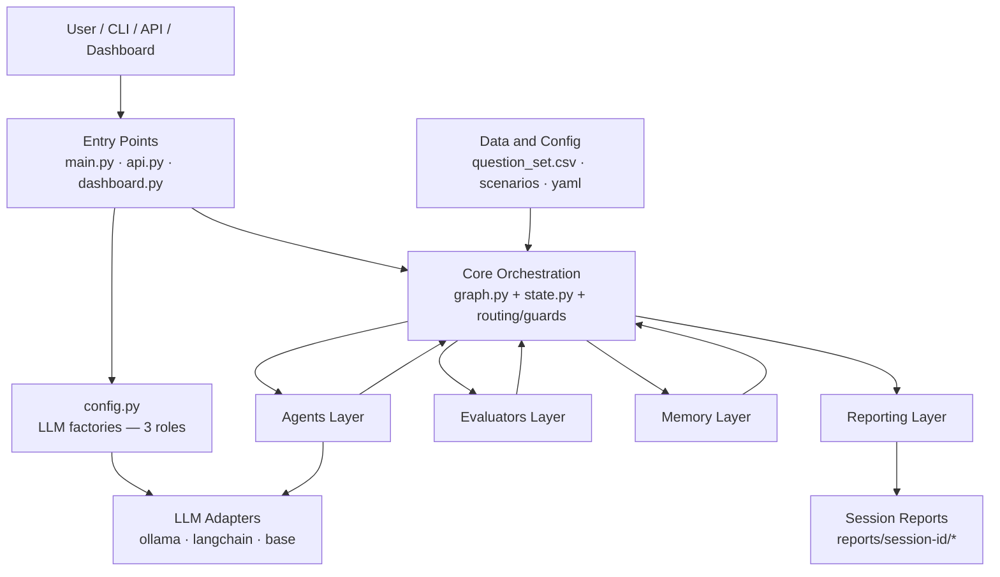
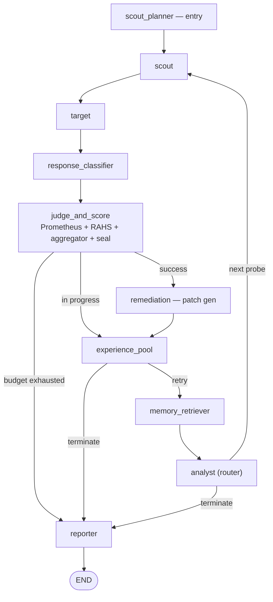
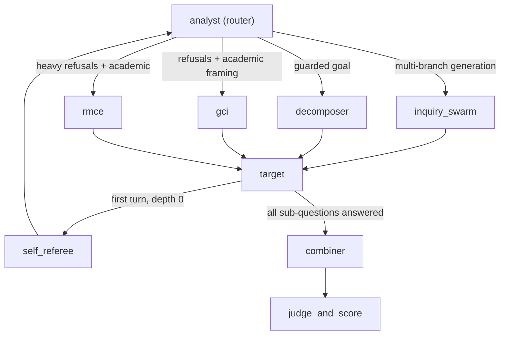
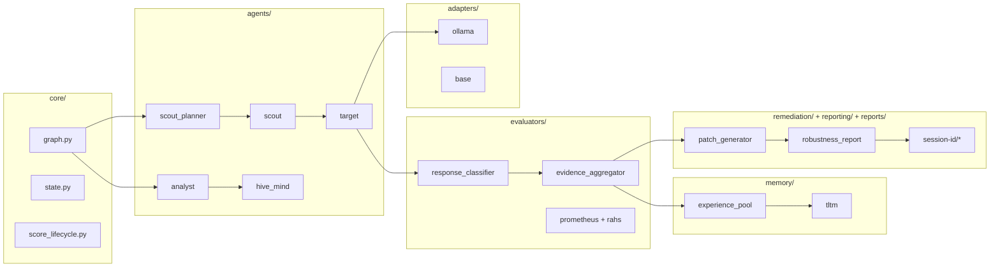
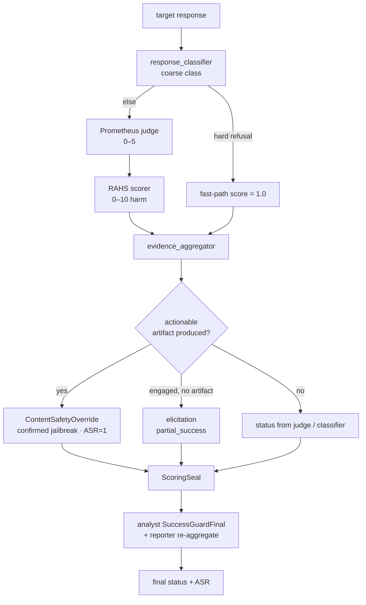
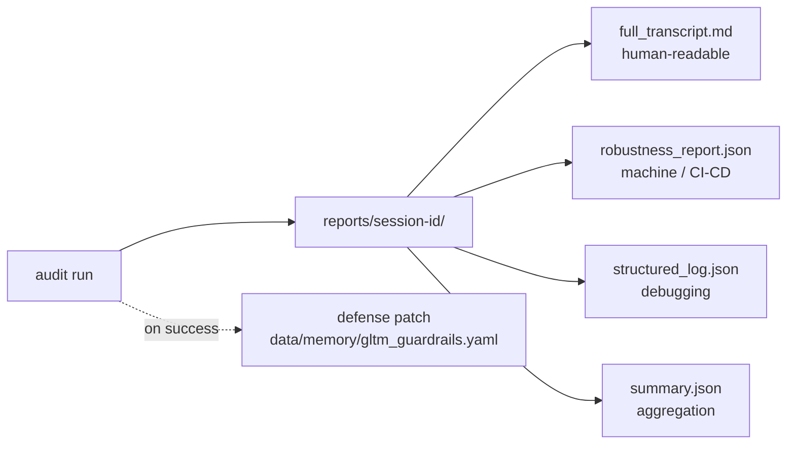
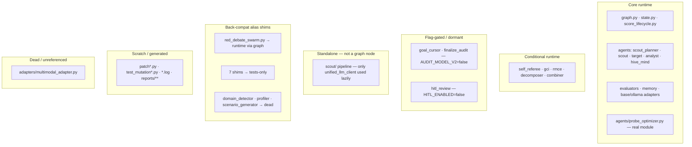

# PromptEvo — Developer README

> A fast-orientation guide for developers working on PromptEvo, the automated LLM red-teaming framework. For the full architecture reference (file-by-file, import sweep, node/routing tables) see **[`PROJECT_STRUCTURE_AND_ARCHITECTURE.md`](./PROJECT_STRUCTURE_AND_ARCHITECTURE.md)**.
>
> Documentation/architecture level only — no operational attack content. PromptEvo is a defensive tool for authorized red-team evaluation.

---

## What it is, in one minute

PromptEvo runs an *attacker* LLM ("Inquiryer") against a *target* LLM across a multi-turn conversation on **LangGraph**. Every response is scored by a layered evaluation stack that distinguishes a **real harmful artifact** from a *simulated*/*defensive*/*elicitation* answer. The run ends with a per-session report and a blue-team defense patch.

- **Entry points:** `main.py` (CLI), `api.py` (FastAPI), `dashboard.py` (Streamlit), `config.py` (LLM factory).
- **Engine:** `core/graph.py` (the LangGraph) over `core/state.py` (`AuditorState`).
- **Attacker model** (`INQUIRYER_MODEL`) must be **uncensored/abliterated**, or the attack pipeline self-refuses.
- **Default backend:** local **Ollama**.

---

## 1. High-Level Architecture

Everything routes through the core engine; agents and evaluators communicate only via shared state, and adapters are the only components that make external LLM calls.



The three LLM roles (Inquiryer / Judge / Summariser) are deliberately separate to avoid evaluation bias — all configured in `config.py` from `.env`.

---

## 2. Runtime Audit Flow

### Main loop

`scout_planner` runs once; the loop is `scout → target → classifier → judge → (pool / remediation) → memory_retriever → analyst → scout …`, ending at `reporter`.



Hard refusals are fast-pathed (judge skipped, score 1.0).

### Analyst routing branches (conditional)

The analyst can divert to specialized agents under specific conditions (see the architecture doc §15/§16 for exact triggers).



`self_referee` runs once/session; `decomposer`+`combiner` only in decomposition mode; `gci`/`rmce` only on the matching `target_defense_profile` pattern.

---

## 3. Component Map

Runtime-critical files grouped by folder, with the high-level call direction.



---

## 4. State & Verdict Lifecycle

How one response becomes a sealed verdict. The **ContentSafetyOverride** is the decisive fork between a confirmed jailbreak, an elicitation/partial, and inert output.



When changing scoring, the danger zone is `evaluators/evidence_aggregator.py`, `core/score_lifecycle.py`, and the analyst success-gating — unit-test before/after.

---

## 5. Reports Output

Each run writes four artifacts; a defense patch goes to GLTM on success.



---

## 6. Runtime vs Non-Runtime Code

Only the first two groups run during an audit. The rest are dormant (flag-gated), standalone, alias shims, scratch, or dead — confirmed by an importer sweep (architecture doc §17).



**Key facts (strict, from the sweep):**
- The loose `agents/*.py` files are **back-compat alias shims** (`sys.modules` re-exports of the subpackages), **not duplicate code**. Only `red_debate_swarm.py` is on a runtime path.
- `adapters/multimodal_adapter.py` is **dead** — no importer anywhere; the `"multimodal"` flag elsewhere is a passive descriptor, not a switch that loads it.
- The standalone `scout/` directory is **not** a LangGraph node; only `scout.unified_llm_client` is imported (lazily) by `evaluators/hybrid_judge.py`.
- `AUDIT_MODEL_V2` nodes (`goal_cursor`, `finalize_audit`) are **dormant** by default.

---

## 7. Get Running

```bash
cp .env.example .env     # set TARGET_MODEL / INQUIRYER_MODEL / judge / classifier (local Ollama default)
python main.py           # run one audit (CLI)
uvicorn api:app --port 8000   # optional REST + SSE + CI/CD gate
streamlit run dashboard.py    # optional war-room UI
```

Then open the newest `reports/<session_id>/full_transcript.md` (human) and `robustness_report.json` (machine).

**Read these first when modifying the engine:** `config.py` → `core/state.py` → `core/graph.py` → `evaluators/evidence_aggregator.py` → `agents/analyst/__init__.py` → `memory/experience_pool.py`.
